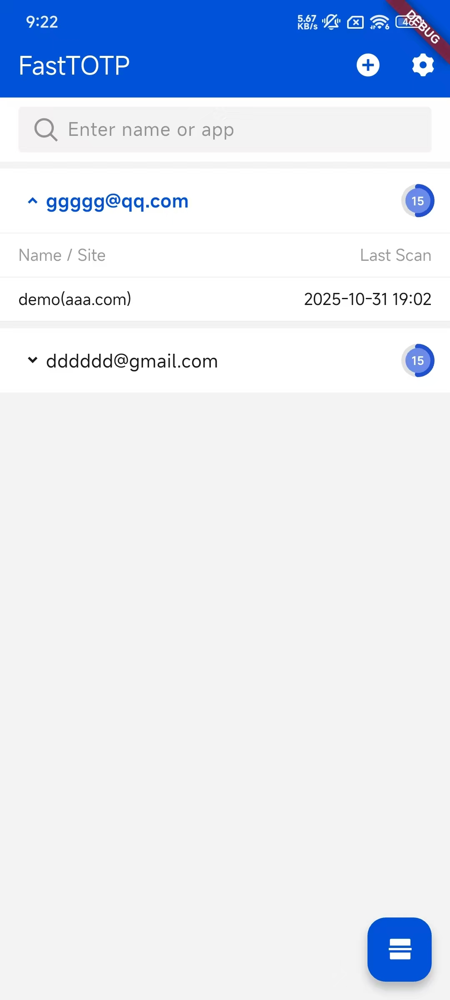

# FastTOTP

一款专为快速安全的二维码登录认证设计的Flutter应用程序，可用于网站和应用间的快速身份验证。提供TOTP生成和生物识别安全功能，提升用户体验。


[**<span style="color: #0052d9">English</span>**](README.md) | [**<span style="color: #0052d9">中文</span>**](README-zh.md)

## 功能特性

- **二维码登录**：快速扫描二维码以验证身份并登录网站和应用程序
- **前端组件**：提供官方React和Vue组件，便于网页集成
- **TOTP生成**：安全的基于时间的一次性密码生成，用于多因素认证
- **生物识别认证**：支持Android和iOS设备上的指纹和面部识别，增强安全性
- **账户管理**：添加和管理多个认证账户
- **多语言支持**：支持13种语言，包括英语、西班牙语、中文、阿拉伯语、德语、葡萄牙语、法语、俄语、印地语、意大利语、日语、韩语和印尼语
- **安全本地存储**：使用SQLite和加密存储保护敏感的认证数据
- **深度链接**：无缝的应用间通信，增强认证流程
- **设备特定安全**：通过混淆设备标识符保护用户隐私

## 截图




### 应用演示

https://github.com/user-attachments/assets/b228a33d-5ed9-49f4-8fba-483f502dd3af

#### App登录

以下是使用FastTOTP进行应用登录的示例代码：

```bash
# app_links
fasttotp://api?url=$base_url&callback=$your_app_scheme&request_id=$request_id
```

### PC登录二维码


使用FastTOTP扫描PC登录二维码，即可快速登录应用。

## 快速开始

### 先决条件

- Flutter SDK（推荐最新版本）
- Dart SDK
- Android Studio / Xcode 用于平台特定开发

### 安装

1. 克隆仓库：
   ```bash
   git clone https://github.com/cyobason/fasttotp.git
   cd fasttotp
   ```

2. 安装依赖：
   ```bash
   flutter pub get
   ```

3. 运行应用：
   ```bash
   flutter run
   ```

## 使用方法

### 二维码登录

1. 在网站或应用程序上提示登录时，查找"扫描二维码登录"选项
2. 打开FastTOTP并点击扫描按钮
3. 将二维码置于扫描框内
4. 应用将自动验证并登录到目标网站或应用程序

### 管理认证账户

1. 点击添加按钮注册新账户
2. 输入所需的账户信息
3. 应用将生成安全的TOTP密钥并本地存储
4. 您的账户将在未来登录时可供快速访问

### 使用生物识别认证

1. 确保您的设备支持生物识别认证（指纹或面部识别）
2. 在应用设置中启用生物识别认证
3. 出现提示时，使用您的生物识别数据快速安全地进行身份验证，无需输入密码

## 技术详情

### 架构

- **流线型架构**：针对快速认证流程和最小延迟进行了优化
- **本地化**：实现Flutter本地化，支持广泛的多语言功能
- **状态管理**：使用Flutter内置的状态管理和StatefulWidgets
- **数据库**：使用SQLite安全地本地存储认证凭据

### 安全特性

- **生物识别验证**：利用设备的安全生物识别API增强认证
- **本地加密**：所有敏感认证数据都经过加密并安全存储
- **设备ID混淆**：通过混淆设备标识符保护用户隐私
- **二维码安全**：使用安全扫描实践验证和处理二维码

### 前端组件

FastTOTP提供官方前端组件，便于网页集成：

- **React组件**：[fasttotp-react](https://www.npmjs.com/package/fasttotp-react) - 适用于React应用
- **Vue 3组件**：[fasttotp-vue-next](https://www.npmjs.com/package/fasttotp-vue-next) - 适用于Vue 3应用
- **Vue 2组件**：[fasttotp-vue](https://www.npmjs.com/package/fasttotp-vue) - 适用于Vue 2应用

这些组件使网站能够轻松集成FastTOTP二维码登录功能，包括自动轮询、过期处理和可自定义的UI元素。

### API文档

#### 认证流程API

FastTOTP使用多步骤API认证流程进行安全登录。以下是所需的端点：

##### 1. 获取公钥端点

**URL**: `{base_url}/get_public_key`

**方法**: `GET`

**请求头**:
- `totp-requestId`: 从二维码获取的请求ID

**响应**:
```json
{
  "data": {
    "key": "public_encryption_key"
  },
  "statusCode": 200
}
```

##### 2. 提交设备和邮箱端点

**URL**: `{base_url}/submit`

**方法**: `POST`

**请求头**:
- `totp-id`: 加密的设备ID
- `totp-email`: 加密的用户邮箱
- `totp-requestId`: 请求ID

**响应**:
```json
{
  "data": {
    "error": "",
    "name": "application_name",
    "domain": "application_domain",
    "unique_id": "application_unique_identifier",
    "secret": "true|false"  // 是否在验证中包含密钥
  },
  "statusCode": 200
}
```

##### 3. 验证TOTP码端点

**URL**: `{base_url}/verify`

**方法**: `POST`

**请求头**:
- `totp-id`: 加密的设备ID
- `totp-code`: 加密的TOTP码
- `totp-email`: 加密的用户邮箱
- `totp-requestId`: 请求ID
- `totp-secret`: (可选) 加密的密钥，仅当submit响应中的"secret"为true时需要

**响应**:
```json
{
  "data": {
    "error": ""  // 空字符串表示成功
  },
  "statusCode": 200
}
```

#### 二维码格式

二维码应包含以下格式的URL：

```
{base_url}?request_id={unique_request_identifier}
```

#### 认证流程

1. 生成包含唯一请求ID的二维码
2. FastTOTP应用扫描二维码并提取URL和请求ID
3. 应用使用请求ID请求公钥
4. 应用加密并提交设备ID和用户邮箱
5. 应用生成TOTP码并提交进行验证
6. 成功验证后，用户登录成功

#### 错误处理

- 所有端点返回`statusCode`字段（200表示成功，401表示认证失败）
- 响应数据中的`error`字段包含任何错误消息（空字符串表示成功）

### 依赖项

主要依赖项包括：

- `ai_barcode_scanner`：二维码扫描和处理的核心功能
- `auth_totp`：用于生成安全的基于时间的一次性密码
- `local_auth`：用于生物识别认证集成
- `app_links`：用于深度链接，促进应用间的无缝认证
- `sqflite`：用于本地数据库存储认证数据
- `flutter_localization`：用于支持13种不同语言
- `tdesign_flutter`：用于创建一致的现代UI体验
- `pointycastle`：用于加密操作以保护敏感数据

## 支持的平台

- Android
- iOS

## 贡献

欢迎贡献！请随时提交Pull Request。

## 许可证

本项目采用Apache-2.0许可证 - 详情请参阅LICENSE文件。

## 联系方式

如有问题或需要支持，请联系项目维护者。