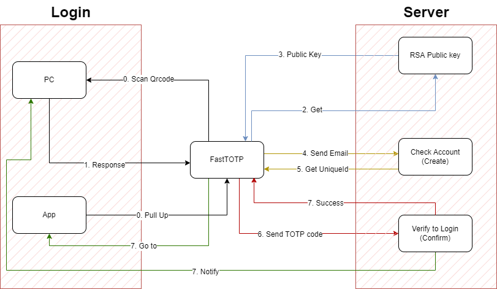
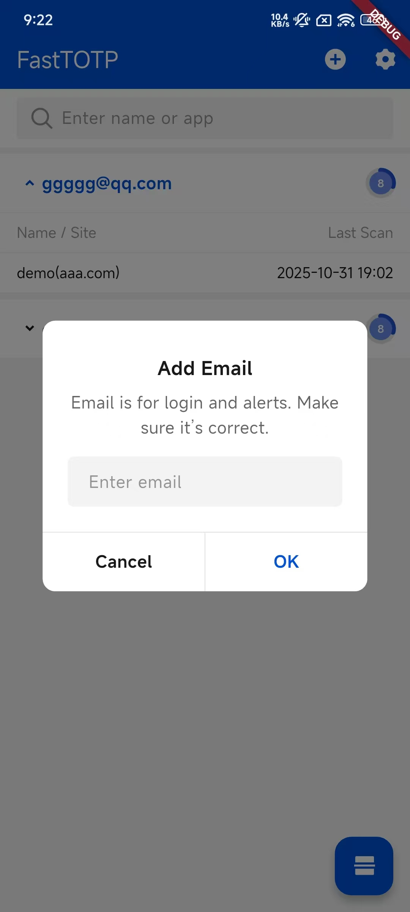
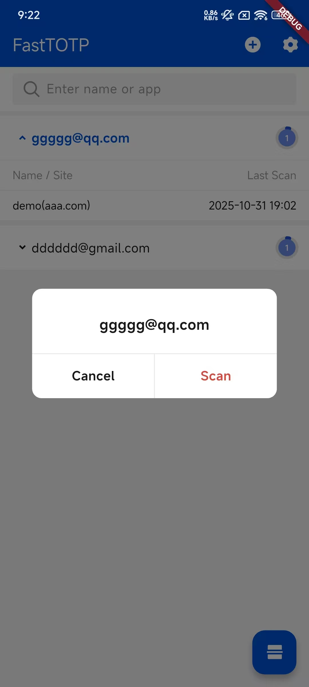
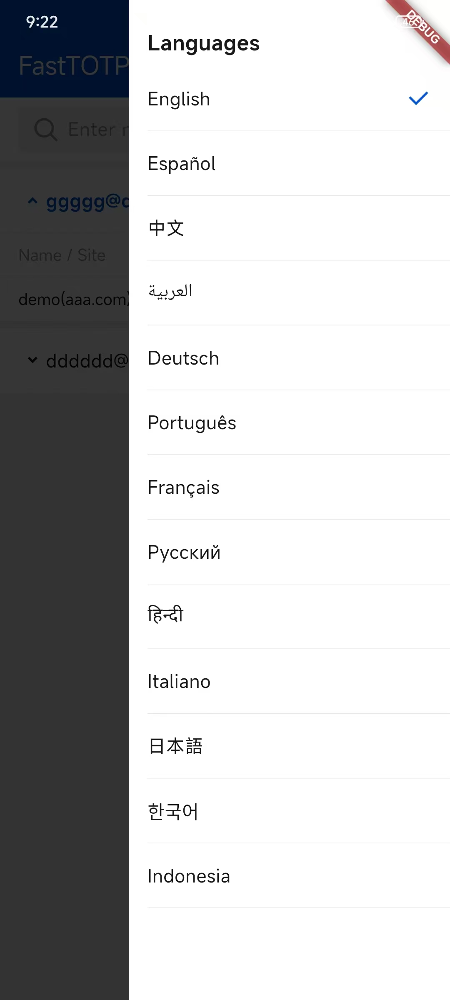

<div align="center">


# FastTOTP

[last-commit]: https://img.shields.io/github/last-commit/cyobason/fasttotp?style=for-the-badge&logo=github&logoColor=C0CAF5&labelColor=414868
[license]: https://img.shields.io/github/license/cyobason/fasttotp?style=for-the-badge&logo=opensourcehardware&label=License&logoColor=C0CAF5&labelColor=414868&color=8c73cc
[![][last-commit]](https://github.com/cyobason/fasttotp/pulse)
[![][license]](https://github.com/cyobason/fasttotp/blob/main/LICENSE)

[**<span style="color: #0052d9">English</span>**](README.md) | [**<span style="color: #0052d9">中文</span>**](README-zh.md)

</div>

A streamlined Flutter application designed specifically for quick and secure QR code-based login authentication across websites and applications. Provides TOTP generation and biometric security features for enhanced user experience.



## Features

- **QR Code Login**: Quickly scan QR codes to authenticate and log in to websites and applications
- **Frontend Components**: Official React and Vue components available for web integration
- **TOTP Generation**: Secure Time-based One-Time Password generation for multi-factor authentication
- **Biometric Authentication**: Enhanced security with fingerprint and face recognition support on both Android and iOS
- **Account Management**: Add and manage multiple authentication accounts
- **Multi-language Support**: Available in 13 languages including English, Spanish, Chinese, Arabic, German, Portuguese, French, Russian, Hindi, Italian, Japanese, Korean, and Indonesian
- **Secure Local Storage**: Uses SQLite and encrypted storage to protect sensitive authentication data
- **Deep Linking**: Seamless app-to-app communication for enhanced authentication flows
- **Device-Specific Security**: Unique device identification with obfuscation to protect user privacy

## Screenshots

<table>
  <tr>
    <td></td>
    <td></td>
    <td></td>
  </tr>
  <tr>
    <td></td>
    <td></td>
    <td></td>
  </tr>
  <tr>
    <td></td>
  </tr>
</table>

### App Demo

https://github.com/user-attachments/assets/f6b4da7c-e351-4c43-8ea1-d68ee6c48589

#### App Login

Here's an example code for implementing FastTOTP authentication in your application:

```bash
# app_links
fasttotp://api?url=$base_url&callback=$your_app_scheme&request_id=$request_id
```

### PC Login QR Code  


Using FastTOTP to scan the PC login QR code, you can quickly log in to the application.

## Getting Started

### Prerequisites

- Flutter SDK (latest version recommended)
- Dart SDK
- Android Studio / Xcode for platform-specific development

### Installation

1. Clone the repository:
   ```bash
   git clone https://github.com/cyobason/fasttotp.git
   cd fasttotp
   ```

2. Install dependencies:
   ```bash
   flutter pub get
   ```

3. Run the application:
   ```bash
   flutter run
   ```

## Usage

### QR Code Login

1. When prompted to login on a website or application, look for the "Scan QR Code to Login" option
2. Open FastTOTP and tap the scan button
3. Position the QR code within the scanning frame
4. The app will automatically authenticate and log you in to the target website or application

### Managing Authentication Accounts

1. Tap the add button to register a new account
2. Enter the required account information
3. The app will generate a secure TOTP secret and store it locally
4. Your account will be available for quick access during future logins

### Using Biometric Authentication

1. Ensure your device supports biometric authentication (fingerprint or face recognition)
2. Enable biometric authentication in the app settings
3. When prompted, use your biometric data to quickly and securely authenticate without entering passwords

## Technical Details

### Architecture

- **Streamlined Architecture**: Optimized for quick authentication flows and minimal latency
- **Localization**: Implements Flutter Localization for extensive multi-language support
- **State Management**: Uses Flutter's built-in state management with StatefulWidgets
- **Database**: SQLite for secure local storage of authentication credentials

### Security Features

- **Biometric Verification**: Leverages the device's secure biometric API for enhanced authentication
- **Local Encryption**: All sensitive authentication data is encrypted and stored securely
- **Device ID Obfuscation**: Protects user privacy by obfuscating device identifiers
- **QR Code Security**: Validates and processes QR codes using secure scanning practices

### Frontend Components

FastTOTP provides official frontend components for easy web integration:

- **React Component**: [fasttotp-react](https://www.npmjs.com/package/fasttotp-react) - For React applications
- **Vue 3 Component**: [fasttotp-vue-next](https://www.npmjs.com/package/fasttotp-vue-next) - For Vue 3 applications
- **Vue 2 Component**: [fasttotp-vue](https://www.npmjs.com/package/fasttotp-vue) - For Vue 2 applications

These components enable websites to easily integrate FastTOTP QR code login functionality with automatic polling, expiration handling, and customizable UI elements.

## WordPress Plugin

FastTOTP also provides an official WordPress plugin for seamless integration with WordPress websites. You can find the plugin code in the [wordpress](wordpress/) directory.

## API Documentation

### Authentication Flow API

FastTOTP uses a multi-step API authentication flow for secure login. Here are the required endpoints:

#### 1. Get Public Key Endpoint

**URL**: `{base_url}/get_public_key`

**Method**: `GET`

**Headers**:
- `totp-requestId`: The request ID obtained from the QR code

**Response**:
```json
{
  "key": "public_encryption_key",
  "request_id": "unique_request_identifier"
}
```

#### 2. Submit Device and Email Endpoint

**URL**: `{base_url}/submit`

**Method**: `POST`

**Headers**:
- `totp-id`: Encrypted device ID
- `totp-email`: Encrypted user email
- `totp-requestId`: The request ID

**Response**:
```json
{
  "error": "",
  "name": "application_name",
  "domain": "application_domain",
  "unique_id": "application_unique_identifier",
  "secret": "true|false"  // Whether to include secret in verification
}
```

#### 3. Verify TOTP Code Endpoint

**URL**: `{base_url}/verify`

**Method**: `POST`

**Headers**:
- `totp-id`: Encrypted device ID
- `totp-code`: Encrypted TOTP code
- `totp-email`: Encrypted user email
- `totp-requestId`: The request ID
- `totp-secret`: (Optional) Encrypted secret key, only if "secret" was true in submit response

**Response**:
```json
{
  "error": ""  // Empty string indicates success
}
```

### QR Code Format

The QR code should contain a URL with the following format:

```
{base_url}?request_id={unique_request_identifier}
```

### Authentication Flow

1. Generate a QR code with a unique request ID
2. The FastTOTP app scans the QR code and extracts the URL and request ID
3. App requests the public key using the request ID
4. App encrypts and submits the device ID and user email
5. App generates a TOTP code and submits it for verification
6. Upon successful verification, the user is logged in

### Error Handling

- All endpoints return a `statusCode` field (200 for success, 401 for authentication failure)
- The `error` field in the response data contains any error message (empty string indicates success)

## Dependencies

Key dependencies include:

- `ai_barcode_scanner`: Core functionality for QR code scanning and processing
- `auth_totp`: For generating secure Time-based One-Time Passwords
- `local_auth`: For biometric authentication integration
- `app_links`: For deep linking to facilitate seamless authentication between apps
- `sqflite`: For local database storage of authentication data
- `flutter_localization`: For supporting 13 different languages
- `tdesign_flutter`: For creating a consistent and modern UI experience
- `pointycastle`: For cryptographic operations to secure sensitive data

## Supported Platforms

- Android
- iOS

## Contributing

Contributions are welcome! Please feel free to submit a Pull Request.

## License

This project is licensed under the Apache-2.0 license - see the LICENSE file for details.

## Contact

For questions or support, please contact the project maintainers.
