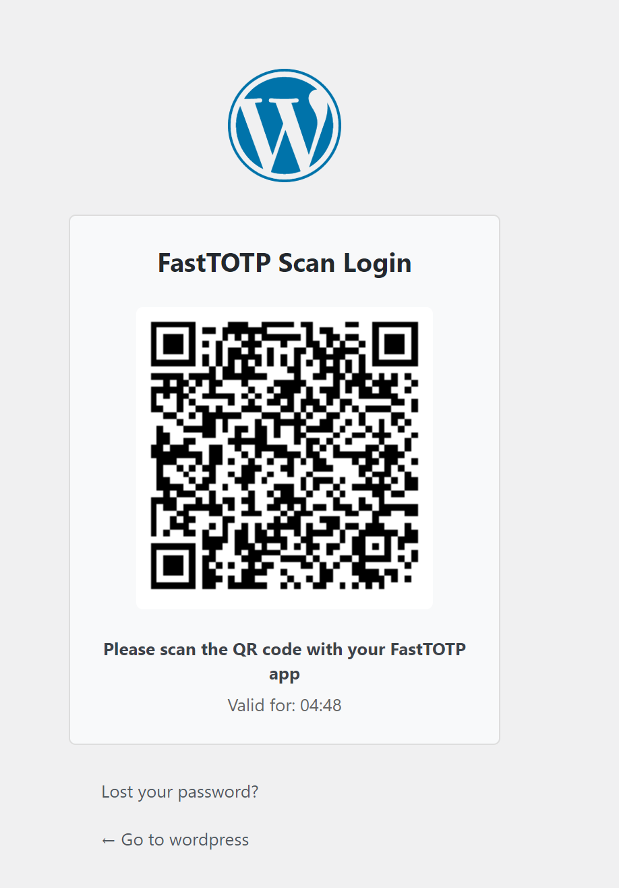

# FastTOTP - WordPress Fast & Secure Login Plugin

[**English**](README.md) | [**中文**](README-zh.md)

## Plugin Introduction

FastTOTP is a plugin that provides a minimalist password-free login experience for WordPress websites. It allows users to authenticate by scanning QR codes and using the FastTOTP mobile application, enabling a quick and secure login process.

- **No Account Registration Required**: No need to create additional user accounts
- **No Password to Remember**: Scan to log in with mobile app, say goodbye to passwords
- **Enhanced Security**: Utilizes TOTP (Time-based One-Time Password) technology and RSA encryption
- **Simple Integration**: Lightweight design, easy to set up and use
- **Highly Customizable**: Can be configured to use FastTOTP login only or alongside conventional login methods

## Plugin Screenshot

## Features

### Core Features
- 📱 **QR Code Scan Login**: Generates QR codes containing secure login information
- 🔒 **TOTP Verification**: Uses time-based one-time passwords for secure authentication
- 🔐 **RSA Encryption**: Employs asymmetric encryption to protect sensitive data during the login process

### Security Features
- 🛡️ **IP Blocking Protection**: Automatically blocks suspicious IPs after multiple failed login attempts
- ⚙️ **Configurable Security Settings**: Allows adjustment of maximum attempt limits and blocking strategies
- 🔑 **Automatic RSA Key Generation**: One-click generation of strong encryption key pairs
- 📝 **Detailed Error Handling**: Provides clear error messages and security prompts

### Flexible Configuration
- 🎛️ **Management Panel**: Intuitive settings page for configuring plugin options
- 🔄 **Dual Mode Support**: Can choose to use only FastTOTP login or alongside traditional login methods
- 🌐 **Multi-language Support**: Supports plugin translation for better internationalization

## Installation Instructions

### Method 1: Install via WordPress Plugin Directory
1. Log in to your WordPress admin dashboard
2. Navigate to **Plugins** > **Add New**
3. Search for "FastTOTP"
4. Click the "Install Now" button
5. After installation, click the "Activate" button

### Method 2: Manual Installation
1. Download the plugin ZIP file
2. Log in to your WordPress admin dashboard
3. Navigate to **Plugins** > **Add New**
4. Click the "Upload Plugin" button
5. Select the downloaded ZIP file and click "Install Now"
6. After installation, click the "Activate" button

### Method 3: FTP Upload
1. Extract the downloaded ZIP file
2. Connect to your website server using an FTP client
3. Upload the `fasttotp` folder to the `wp-content/plugins/` directory
4. Log in to your WordPress admin dashboard
5. Navigate to the **Plugins** page
6. Find "FastTOTP" and click "Activate"

## Configuration Guide

After installing and activating the plugin, follow these steps to configure it:

1. Log in to your WordPress admin dashboard
2. Navigate to **Settings** > **FastTOTP**
3. In the "RSA Key Settings" section, click the "Generate RSA Keys" button
4. Configure the following options according to your needs:
   - **Enable FastTOTP**: Controls whether FastTOTP login functionality is enabled
   - **Allow Only FastTOTP Login**: Choose whether to disable traditional password login
   - **Maximum Login Attempts Before IP Blocking**: Set the threshold for allowed failed attempts
5. Click the "Save Changes" button

## Usage Instructions

### User Login Process
1. Visit your website's login page (typically `your-site.com/wp-login.php`)
2. You will see the FastTOTP QR code login section
3. Use the FastTOTP mobile application to scan the displayed QR code
4. Confirm the login request in the mobile application
5. Upon successful login, you will be automatically redirected to the WordPress admin dashboard or website frontend

### QR Code Expiry Handling
- Each QR code is valid for only 5 minutes
- The page will display a real-time countdown showing the remaining valid time of the QR code
- After expiry, an expiration notification will be displayed
- Click the "Refresh QR Code" button to generate a new valid QR code

## Security Notes

### Data Security
- The login process uses RSA asymmetric encryption to protect sensitive data
- Each login request generates a unique request ID
- Temporary data is stored using WordPress's transient API with automatic expiration

### IP Blocking Mechanism
- The plugin tracks failed login attempts from the same IP address
- When the number of failed attempts exceeds the set threshold, the IP will be temporarily blocked
- The blocking mechanism uses WordPress transients, with a default blocking time of one hour

## Technical Details

### How It Works
1. The plugin generates a QR code containing a unique request ID on the login page
2. The user scans the QR code using the FastTOTP application
3. The mobile application obtains the site's public key and encrypts user information
4. The server receives the encrypted data and decrypts it using the private key
5. Validates whether the TOTP code is valid
6. Upon successful validation, creates a user session and completes the login

### REST API Endpoints
The plugin registers the following REST API endpoints for the login process:
- `/wp-json/fasttotp/v1/get_public_key` - Get the site's public key
- `/wp-json/fasttotp/v1/submit` - Submit device and user information
- `/wp-json/fasttotp/v1/verify` - Verify TOTP code
- `/wp-json/fasttotp/v1/check` - Check login status

## Compatibility

- **WordPress Version**: Requires WordPress 5.8 or higher
- **PHP Version**: Requires PHP 7.2 or higher
- **Browser Support**: Compatible with all modern browsers (Chrome, Firefox, Safari, Edge)
- **Mobile Application**: Requires using the FastTOTP mobile app (iOS and Android)

## Troubleshooting

### Common Issues

1. **QR Code Not Displaying**
   - Ensure FastTOTP is enabled in settings
   - Check that PHP version meets requirements (7.2+)
   - Clear browser cache and refresh the page

2. **Cannot Login After Scanning**
   - Ensure mobile device time is synchronized with server time
   - Check if RSA keys are correctly generated
   - Verify if the maximum login attempts limit has been exceeded

3. **IP Blocked**
   - Wait for one hour and try again (default blocking time)
   - Can manually remove related transient records from the WordPress database to unblock

## Changelog

### Version 1.0
- Initial release
- Implemented QR code scanning login functionality
- Added TOTP verification mechanism
- Integrated RSA encryption protection
- Implemented IP blocking security features
- Added 5-minute QR code validity period and countdown display

## Contribution Guidelines

Community contributions are welcome! If you want to contribute to the FastTOTP plugin, please:

1. Fork the GitHub repository
2. Create your feature branch (`git checkout -b feature/amazing-feature`)
3. Commit your changes (`git commit -m 'Add some amazing feature'`)
4. Push to the branch (`git push origin feature/amazing-feature`)
5. Open a Pull Request

## License

The FastTOTP plugin is released under the GPLv2 or later license. For more details, please refer to the [LICENSE.txt](LICENSE.txt) file.

## Contact Us

- **GitHub Repository**: https://github.com/cyobason/fasttotp
- **Issue Reporting**: Please submit Issues in the GitHub repository
- **Author**: Cyobason

---

**Disclaimer**: By using this plugin, you agree to follow the terms of the license agreement. While we strive to ensure the security and stability of the plugin, the author is not responsible for any loss caused by using this plugin.

© FastTOTP. All rights reserved.